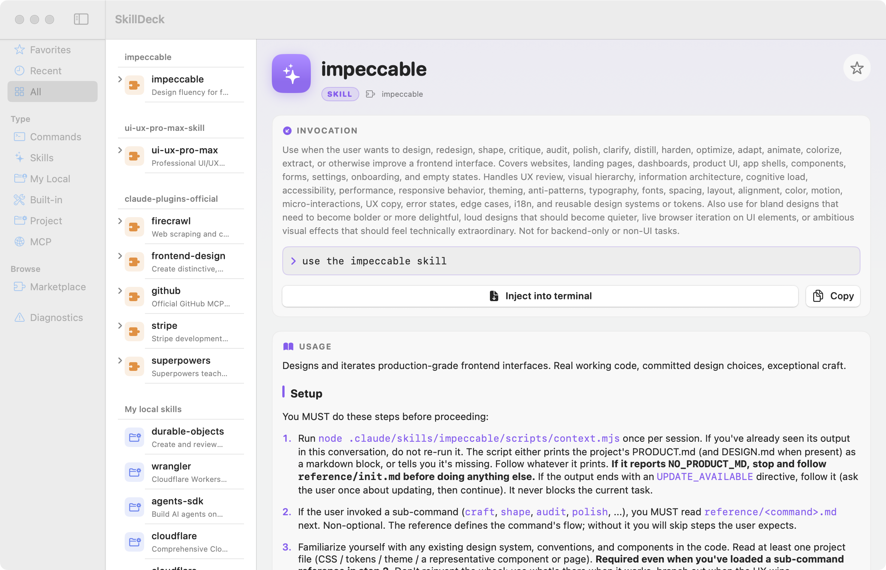

<div align="center">

# 🎛️ SkillDeck

### Your Claude Code skills & commands, finally at your fingertips.

A native macOS app that turns every skill, command, and plugin you've installed into a
searchable, beautiful cheatsheet — and sends any command straight to your terminal with a click.

**English** · [简体中文](README.zh-CN.md)

[**⬇ Download for macOS**](https://github.com/Arran5353/skill-toolkit/releases/latest) · [Report a bug](https://github.com/Arran5353/skill-toolkit/issues) · [Build from source](SkillDeck/README.md)



</div>

---

## Why SkillDeck?

If you've installed more than a handful of Claude Code skills and plugins, you've probably
hit this: you *know* you have a skill for the thing — you just can't remember its name, what
it does, or how to invoke it. So you stop, dig through folders, or just forget it exists.

**SkillDeck is the cheatsheet that fixes that.** It scans everything you have installed,
lays it out in a clean hierarchy, and lets you fire off any command into your active terminal
with one click. Install something new? It shows up automatically.

## ✨ Features

- **🗂 Everything in one place.** Skills, commands, your own local skills, project-specific
  skills, Claude Code's built-in slash commands, and MCP servers — all discovered automatically
  and grouped by source.
- **🌳 Clear hierarchy.** Browse by **Marketplace → Plugin → Skill/Command**, or filter by type.
  Skills that have sub-commands (like `/impeccable polish`) expand to show every one.
- **⤵️ Click to inject.** Click any command and it's typed into your frontmost terminal via ⌘V —
  ready to run, never auto-submitted. Works with Terminal, iTerm, Ghostty, VS Code, and more.
- **🛒 Marketplace browser + one-click install.** See every plugin available from your
  marketplaces, which ones are installed, and install new ones without leaving the app —
  their skills appear in the tree seconds later.
- **📖 Beautiful usage docs.** Each skill's documentation is rendered as real Markdown —
  headings, lists, tables, and syntax-highlighted code blocks — not raw text.
- **⭐ Favorites & recents.** Star what you use most; recently-used items float to the top.
- **🔎 Menu bar access.** A menu bar icon gives instant access to favorites and recents from anywhere.
- **♻️ Always current.** A file watcher keeps the catalog in sync the moment you add or remove
  a skill or plugin.
- **🖥 Native & lightweight.** Pure Swift / SwiftUI. No Electron, no background services, ~700 KB.

## 🚀 Get started

### Download (easiest)

1. Grab the latest **SkillDeck.dmg** from the [**Releases page**](https://github.com/Arran5353/skill-toolkit/releases/latest).
2. Open the `.dmg` and drag **SkillDeck** into **Applications**.
3. **First launch:** this build isn't signed with a paid Apple Developer ID, so macOS
   Gatekeeper will block it. **Right-click SkillDeck → Open**, then click **Open**.
   *(On macOS 15: System Settings → Privacy & Security → scroll down → **Open Anyway**.)*
4. Grant **Accessibility** permission when prompted — that's what lets SkillDeck type into your
   terminal. Without it, SkillDeck still works in **copy-only** mode (it copies the command and
   you paste it yourself).

### Build from source

Prefer to compile it yourself (and skip the Gatekeeper step)?

```bash
git clone https://github.com/Arran5353/skill-toolkit.git
cd skill-toolkit/SkillDeck
swift run SkillDeckApp
```

Requires macOS 15+ and Swift 6.1 / Xcode 16. See [SkillDeck/README.md](SkillDeck/README.md)
for packaging and contributing details.

## 📋 Requirements

- **macOS 15+**
- The **`claude` CLI** (only needed for marketplace install) — on your `PATH` or at `~/.local/bin/claude`

## 🙋 FAQ

**Is it safe? What does it access?**
SkillDeck only reads your local `~/.claude` folder (skills, plugins, marketplaces) and writes
its own preferences to `~/Library/Application Support/SkillDeck`. It never touches your `~/.claude`
files. It's fully open source — read every line here.

**Why does it need Accessibility permission?**
Only to simulate ⌘V so it can paste a command into your terminal. Decline it and SkillDeck
falls back to copy-only mode.

**"Unidentified developer" warning?**
The public build isn't notarized (that needs a paid Apple account). Right-click → Open once,
or build from source.

## 🤝 Contributing

Issues and PRs welcome. See [CONTRIBUTING](SkillDeck/CONTRIBUTING.md). The codebase is small,
fully tested, and split into a pure-logic core (`SkillDeckCore`) plus a thin SwiftUI layer —
easy to extend with new data sources or features.

## 📄 License

MIT © Yazhuo Zhou
